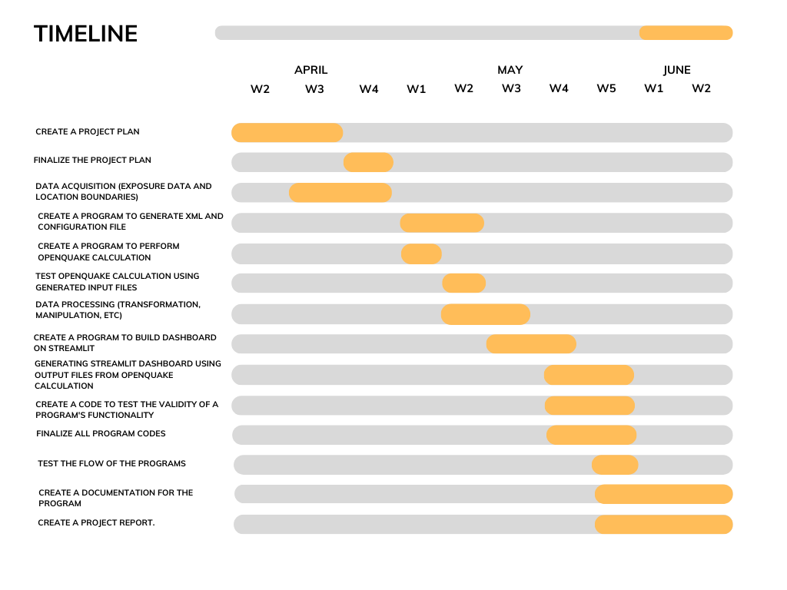

# **Seismic Risk Index Map of Perth, Western Australia Based on Building Vulnerability**
#### Putri Natari Ratna - u7582024
---

## **Executive Summary**

Perth's seismic hazard was previously considered low, but the seismic threat and vulnerability of the Perth Metropolitan Area to earthquake damage have significantly increased due to population growth and increased seismic activity in the east of the city. To mitigate the risk of seismic hazards, it is crucial to understand the physical vulnerability of buildings and infrastructure to these hazards. To assess the level of risk posed by earthquakes in the region, I plan to create an interactive static dashboard that shows seismic risk index map of the Perth area based on the building vulnerability for each suburb. This dashboard includes the Perth seismic hazard map, fragility curve, and damage distribution map. Target user for this dashboard would be students or researchers.

---

## **Goals**

This project aims to simplify the process of generating a seismic risk index map by creating programs that can perform the necessary calculations and visualizations. In order to achieve this main goal, the project can be broken down into the following smaller goals:
  - Create a function to create `xml` files as the input file for risk calculation using `openquake.engine` library
  - Calculate seismic risk based on building vulnerability using `scenario damage` mode from `openquake.engine` library
  - Create a visual representation of the ground shaking intensity in different areas (PGA) of the Perth, Western Australia.
  - Create damage distribution map to identify and spatially represent areas that are particularly vulnerable to seismic hazards
  - Build a static dashboard that contains a report on seismic risk index map of Perth Area for each suburb. The dashboard will have several features that will help user to interact with the dashboard, including:
    1. `Zoom` : Users will be able to zoom in and out of the map to get a more detailed or broader view of the seismic risk index data
    2. `Pan` :  Users will be able to move the map view to different areas of the Perth Area to explore the seismic risk index data for different suburbs.
    3. `Filter` : Users will be able to apply filters to the seismic risk index data, such as by risk level, type of building, location, to focus on the areas of interest to them.
    4. `Download` : Users will be able to download the seismic risk index data for their selected suburbs in a CSV formats, for further analysis or sharing.
---

## **Background and Innovation**  

Perth, which hosts 75% of Western Australia's population, is the largest city in the state and the fourth most populous urban area in Australia. However, the city's rapid population growth in recent years has resulted in a corresponding increase in its vulnerability to natural disasters, including seismic hazards.

Seismic hazard in Perth is strongly influence by the south-west seismic zone (SWSZ), a region with high earthquake frequency. The SWSZ is one of the most seismically active areas in Australia, having experienced several earthquakes with local magnitude 5.9 or higher in the past 40 years. This hazard can cause significant damage to buildings and infrastructure, as well as loss of life. In order to mitigate the risk of seismic hazards, we need to understand the physical vulnerability of buildings and infrastructure to these hazards through seismic risk assessment.

Seismic risk assessment involves consodering exposure model, structural vulnerability, and seismic hazard analysis. Here, exposure model is created by identifying distribution of building in each suburb of Perth, including classifying them into residential building and non-residential building. The structural vulnerability to earthquake is defined by the fragility curve, which provides information on the likelihood of a building achieving specific levels of damage grades for each level of the seismic hazard parameter (PGA). Furthermore, seismic hazard analysis is represented by peak ground acceleration for Perth Area.

--- 

### **Review on Existing Program for Seismic Risk Assessment**  

`OpenQuake Engine` is a software platform designed to help users conduct seismic hazard and risk assessments. It could be accessed through `OpenQuake WebUI`, a web-based user interface that allows users to access and interact with the `OpenQuake Engine`. This software offers several calculation mode to assess seismic hazard and risk, one of them is `scenario_damage` mode.  
The steps that user take to use this software are as follow:
- Prepare input files that at least consist of `exposure_model.xml`, `rupture_model.xml`, and `job.ini`. These file could be generated from `OpenQuake Input Parameter Toolkit` (IPTK) via web-browser. 
- Compress these file into `ZIP` file and upload it to `OpenQuake WebUI`.
- Start calculation process.
- Once the calculation has done, user can open analyze the result via a Geographic Information System (GIS Software), such as `QGIS`.  

These steps are easy to follow, except it has some disadvantages. The `OpenQuake Engine` needs a lot of computer memory to run the calculation, especially for the newest version. In my experience, it needs 0.5 GB memory for each core of the computer. As a result, if the computer does not have enough memory, the calculation can not be executed. Furthermore, users also needs to have GIS software that takes much memory as well to visualize the result. To overcome these downsides, this project will create `Python` programs that could create the `input` files and run `scenario damage assessment` calculation programmatically. The output of this program will be visualized into an interactive dashboard that will help users to analyze and interpret the results. In summary, this `Python`-based project will cover the entire process of generating a seismic risk index map.

---

## **Resources & Timeline**

### **Resources**
Data that will be used include:
  - Ground Motion Prediction Equation from `Allen (2012)`
  - Fragility curve from HAZUS for wood, unreinforced masonry, and reinforced concrete.
  - Building distribution data in Perth from `Open Street Map` data
  - Perth and its suburb boundaries from Australian Bureau of Statistics (shapefile)
 
Main python library that will be used include:
  - `openquake` as a library to calculate seismic hazad and risk assessment
  - `GeoPandas` as a library for working and manipulating geospatial data 
  - `streamlit` as an open-source Python library to create and deploy interactive visualizations and dashboards
  - `folium` as a library to create interactive maps
  - `xml.etree.ElementTree` as a library to create `xml` file

---
### **Timeline**
Here is the timeline for the project:  

*Figure 1. Timeline of the project*

---

## **Testing and Validation**

### **Testing**

- In this project, **unit testing** will be used to validate the functionality of the program. The purpose of these tests is to ensure that the functions works in the right way. Several individual functions within program will be tested using the `unittest.TestCase` class. 
- Since the program will involve user input, the `unittest.mock.patch` decorator will be used to simulate user input during the test cases. By patching the `builtins.input` function, we can control the inputs provided to the functions being tested. The `side_effect` parameter of `patch` is set to a list of input values to simulate a sequence of user inputs.
- The `assertion` method, such as `assertEqual()` method from the `unittest.TestCase` class, will be used to compare the actual results of the tested functions against the expected results. This assertion ensures that the functions produce the desired output.
- Since the program will generate a file as well, the test case will mock the file writing process using `builtins.open` and `mock_open`, allowing us to capture the written content and verify if it matches the expected content.

---

### **Validation**

There are several validation mechanisms to ensure the validity of user inputs. These validations are important to guarantee that the provided inputs meet the expected format and specific criteria. There will be three validation processes, including:
1. **Numeric Validation**: To validate numeric inputs, the program will check if the user-provided values are indeed numbers, whether it is `int` or `float`. If the input is not a valid number, an error message is displayed, prompting the user to provide a valid numeric value. 
2. **Input Range Validation**: For inputs that will have specific ranges or limits, such as numerical values within a certain range, the program will validate whether the provided input falls within the acceptable range.
3. **String Validation**: It involves verifying that user inputs are in the expected string format. This may include checking for the presence of certain characters or validating against predefined patterns or regular expressions. 
---

## **Documentation**

Documentation of this project will be in the form of `README.md` file that consists of:
  - Introduction: Introduce the program, its purpose, and what it is designed to do.
  - Program Structure: Describe the overall structure of the program and how it is organized.
  - Program Flow: Outline the sequence of steps that the program follows when it is run.
  - Installation: Provide instructions for installing any required libraries or dependencies.
  - Usage: Explain how to use the program and provide any necessary command line arguments, input formats, or other relevant information.
  - Samples and Demo: Provide samples of file that are needed in the program and also samples of output generated from the program.
  - Limitation: Explain limitations or constrains of the program.