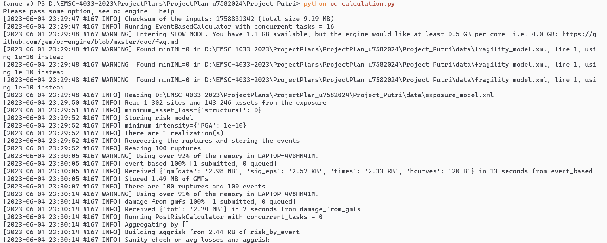

# EMSC4033 - Project Report
#### Putri Natari Ratna - u7582024
---
## **Seismic Risk Index Map of Perth, Western Australia Based on Building Vulnerability**


## **Introduction**

This project comprises three main programs designed to facilitate seismic risk analysis and visualization.  

1. **`job_xml_generator.py`**

    `job_xml_generator.py` is a program designed to generate NRML data model (XML-based data) and configuration file that serve as input for `oq_calculation.py`. It accepts several types of user inputs, which are defined in `user_input` module, to enable customization during the file generation process, so that users can provide specific parameters, settings, or configuration details. There are four file that could be created, including `exposure_model.xml`, `fragility_model.xml`, `rupture_model.xml`, and `job.ini`.  
---
2. **`oq_calculation.py`**  

    `oq_calculation.py` is a program aimed to performs OpenQuake calculations required for ground motion modeling and probability of damage distribution. It uses input files generated from `job_xml_generator.py` and a `csv` file that has information about exposure model defined in `exposure_model.xml`.  
---
3. **`streamlit_app.py`**  

    `streamlit_app.py` is a program that offer a streamlined dashboard experience on Streamlit, allowing users to explore and interact with the outputs generated by `oq_calculation.py` alongside predefined `shapefile` (\*.shp) data.  

Together, these programs provide a comprehensive solution for seismic risk assessment and visualization, simplifying the process of analyzing and visualizing potential earthquake impacts. The flow of these programs can be seen in `Figure 1`.

&nbsp;

*Figure 1. Flow of the programs in this project*

---
## **Instructions**
To successfully run this program, please follow these instructions:

1. **Install Dependencies**: Here are some dependencies that should be installed to run the program:
    - `openquake.engine`: a module related to the OpenQuake engine, which is an open-source platform for seismic hazard and risk assessment. It provides functionalities for performing seismic calculations and analysis.
    - `streamlit`: a Python library used for creating interactive and customizable web applications for dashboards.
    - `numpy`: a library for working with large, multi-dimensional arrays and matrices, along with a wide range of mathematical functions to operate on these arrays.
    - `scipy`: a library that provides additional scientific and numerical computing tools, including modules for optimization, interpolation, linear algebra, statistics, signal processing, and more.
    - `pandas`: a library for data manipulation and analysis. It provides data structures, such as dataframes, and functions for handling and processing structured data.
    - `geopandas`: an extension of the pandas library that adds support for working with geospatial data. It provides data structures to handle geospatial datasets, along with functions for spatial operations, mapping, and visualization
    - `matplotlib`: a plotting library for creating various types of static, animated, and interactive visualizations. 
    - `folium`: a library used for creating interactive maps and visualizations. It is built on top of the leaflet.js library and allows users to generate maps with markers, polygons, heatmaps, and other overlays. Folium is often used for geospatial visualizations in web applications.
    - `streamlit-folium`: a library that integrates two great open-source projects in the Python ecosystem: Streamlit and Folium
    - `branca`: a library that provides utilities for creating and customizing interactive leaflet.js maps. It offers functions for creating map tiles, controlling map appearance, adding overlays, and incorporating other elements into leaflet-based maps.
    - `beautifulsoup4`: a library used for web scraping and parsing HTML or XML documents. 
    - `lxml` : a library that contains xml parser for `beautifulsoup4`.  

    All of these dependencies is provided in [requirements.txt](./Project_Putri/requirements.txt). To install it, open the terminal or command prompt and navigate to your working directory. Once inside the directrory, execute the following command:
    ``` bash
    pip install -r requirements.txt
    ```
    This command will automatically install all the dependencies listed in the [requirements.txt](./Project_Putri/requirements.txt) file, ensuring that the system has all the necessary packages and libraries to run the code smoothly.
    
    > **WARNING**
    > - streamlit version required in this program only works for `Python` version >= 3.7 and !=3.9.7  
    > - If you already have some of libraries/modules defined in [requirements.txt](./Project_Putri/requirements.txt), there may be some dependency conflicts, and you may need to resintall them by executing the following command:
    > ``` bash
    > pip install --upgrade --force-reinstall -r requirements.txt
    > ```
---
2. **Run `job_xml_generator.py`**
    - Prepare all parameters/setting that will be inputted in this program. As a sample, [samples_parameter](./Project_Putri/samples/samples_parameter.xlsx) is prepared in [samples](./Project_Putri/samples/) folder as an example to guide you running this program.
    - Create [data](./Project_Putri/data/) folder.
    - Prepare `csv` file that has information about exposure model that will be defined in `exposure_model.xml`. This file should be stored in [data](./Project_Putri/data/) folder. Information about how to create the `csv` file could be accessed in [OpenQuake_docs](https://docs.openquake.org/oq-engine/manual/latest/risk.html). As samples, [new_exposure_model.csv](./Project_Putri/samples/data/new_exposure_model.csv) is also prepared in [samples/data](./Project_Putri/samples/data/) folder.
    - To run this program execute the following command in your terminal or command prompt:  
    ``` bash
    python job_xml_generator.py
    ```
    - After you execute the program, a user prompt will appear where you can choose which file you want to generate first as shown in `Figure 2`. Once you chose, there will be another prompt that asks you to fill all of the parameters. You can use parameters in [samples_parameter](./Project_Putri/samples/samples_parameter.xlsx) is prepared in [samples](./Project_Putri/samples/) folder here.  
    
    &nbsp;

    *Figure 2. Prompt for user to input all of the parameters or settings*

    &nbsp;

    - All generated files (`exposure_model.xml`, `fragility_model.xml`, `rupture_model.xml`, and `job.ini`) will be stored in [data](./Project_Putri/data/) folder.
    - As samples, [exposure_model.xml](./Project_Putri/samples/data/exposure_model.xml), [fragility_model.xml](./Project_Putri/samples/data/fragility_model.xml), [rupture_model.xml](./Project_Putri/samples/data/rupture_model.xml), and [job.ini](./Project_Putri/data/job.ini) have been generated and could be found in [samples/data](./Project_Putri/samples/data/) folder.
---
3. **Run `oq_calculation.py`**
    - Input files for this program are generated from `job_xml_generator.py`.
    - Make sure that all `xml` files defined in `job.ini` has the same name with `xml` file in the folder.
    - Run this program by executing the following command:
    ``` bash
    python oq_calculation.py
    ```
    - If the program runs successfully, you will see some processes in your terminal or command prompt as shown in `Figure 3`.
    
    &nbsp;
    
    *Figure 3. `oq_calculation` program is running successfully*
    
    &nbsp;

    - There are 5 outputs generated by this program, including `gmf_data_X.csv`,`avg_gmf_X.csv`,`damages-rlzs-000_X.csv`, `aggrisk-_X.csv`, and `risk_by_event_X.csv`, with `X` is `calculation_id`. For example, if one of your output is `avg_gmf_160.csv`, your `calculation_id` is `160`. These files are stored in [output](./output/) folder. 
    - As samples, [gmf_data_95.csv](./Project_Putri/samples/output/gmf-data_95.csv), [avg_gmf_95.csv](./Project_Putri/samples/output/avg_gmf_95.csv), [damages-rlzs-000_95.csv](./Project_Putri/samples/output/avg_damages-rlz-000_95.csv), [aggrisk-_95.csv](./Project_Putri/samples/output/aggrisk-_95.csv), and [risk_by_event_95.csv](./Project_Putri/samples/output/risk_by_event_95.csv) have been generated and could be found in [samples\output](./Project_Putri/samples/output/) folder. 
---
4. **Run `streamlit_app.py`**
    - Input files for this program are generated from  `oq_calculation.py` program and predefined `shapefile` data required for spatial visualization. These data could be found in [output](./Project_Putri/output/) and [SHP](./Project_Putri/SHP/) folder, respectively.
    - To run this program, execute the following command:
    ``` bash
    streamlit run streamlit_app.py -- [calculation_id]
    ```
    For example, if the `calculation_id` is 160, execute the following command:
    ``` bash
    streamlit run streamlit_app.py -- 160
    ```
    - As described before, `calculation_id` is id for every output from `oq_calculation.py`
    - This command will start the Streamlit server, and you can access the dashboard by opening the provided local URL in your web browser as shown in `Figure 4` and `Figure 5`.

    &nbsp;
    *Figure 4. Local URL in the web browser to access the dashboard after executing command to start the streamlit server*

    &nbsp;
    *Figure 5. Process of generating the dashboard on the web browser*
---

## **Testing and Validation**
### **Validation**
There are several validation mechanisms to ensure the validity of user inputs. These validations are crucial to guarantee that the provided inputs meet the expected format and specific criteria. Here is a brief explanation of the validation process:
1. **Numeric Validation**: To validate numeric inputs, the program check if the user-provided values are indeed numbers, whether it is `int` or `float`. If the input is not a valid number, an error message is displayed, prompting the user to provide a valid numeric value. This validation is implemented in `check_number(message,int_num=False,lower_lim=None,upper_lim=None)` function. 
2. **Input Range Validation**: For inputs that have specific ranges or limits, such as numerical values within a certain range, the program validate whether the provided input falls within the acceptable range.This validation is also implemented in `check_mumber(message,int_num=False,lower_lim=None,upper_lim=None)` function. The numeric and range validation can be seen in `Figure 6`.

&nbsp;

*Figure 6. Numeric and range validation*  

&nbsp;

3. **String Validation**: It involves verifying that user inputs are in the expected string format. This may include checking for the presence of certain characters or validating against predefined patterns or regular expressions. This validation implemented in some function, e.g. `text_input(message,allow_spaces=False)` function as shown in `Figure 7`. 

&nbsp;
*Figure 7. String validation*

---
### **Testing**
In this project, **unit testing** is used to validate the functionality of the `job_xml_generator` and `user_input` modules. The purpose of these tests is to ensure that the functions works in the right way.
- Each test method in the `TestJobXmlGenerator` class corresponds to a specific function being tested. 
- The `@patch` decorator is used to mock the input function, allowing the tests to provide predefined input values. This helps simulate different user inputs and ensures correct test results.
- Inside each test method, the expected output of the function under test is defined, and the actual output is compared using the `self.assertEqual` assertion method. If the expected and actual values match, the test passes; otherwise, it fails.
- The `mock_open` function is used to mock the file creation and opening process within the `create_job_ini` function. This allows the test to verify that the function generates the expected content.

These testing are implemented in `tests.py`. Here are some descriptions of tests that are run in the code:
1. The class `TestJobXmlGenerator`, which is inheriting `unittest.TestCase`, is the base class for all test cases in the `unittest` framework.
2. The `TestJobXmlGenerator` class contains several test methods, each starting with the `test_` prefix. These methods define specific test cases for different functionalities in the `job_xml_generator` and `user_input` modules.
3. The `@patch` decorator is used to mock the `input` function and provide specific values for user input during the tests. The `side_effect` parameter is used to specify the input values as a list.
4. As an example, `test_area_type_pick` tests the `area_type_pick` function from the `user_input` module. Inside the test method, `mock_input` is passed as a parameter, which will provide the specified inputs when the `input` function is called within the `area_type_pick` function.
5. Within each test method, assertions are made using the `self.assertEqual` method. The expected values are compared to the actual return values from the functions being tested to check if they match.

To run this test, execute the following command:
```bash
python -m unittest tests
```
`Figure 8` shows a snippet of the result from executing the test.

&nbsp;
*Figure 8. Snippet of the result from executing the test. It can be seen that tests on `absolute_relative_input`, `area_type_pick`, `business_cost_input`, and `check_number` functions are success.*

---

## **Samples and Demo**
Samples of the output generated from `job_xml_generator.py` and `oq_calculation.py` could be found in [samples](./samples/) folder. These samples could be used to run streamlit dashboard demo. [SHP](./SHP/) folder that holds all shapefile needed to run the dashboard is already available. To run the demo, execute the following command:

```bash
streamlit run demo_streamlit_app.py
```
This command will start the Streamlit server, and you can access the dashboard by opening the provided local URL in your web browser. 

An example pdf-version of the streamlit dashboard generated from `demo_streamlit_app.py` can be seen in [this pdf file](./streamlit_app.pdf) 

---
## **Limitations**

There are some limitations of these programs,
1. `job_xml_generator.py`
    - `rupture_model_input()` and `create_rupture_model_xml()` functions only work for **Simple Fault Geometry**. It has not facilitated other rupture types like **Arbitrary Fault Rupture**, **Single Planar Rupture OR Multi-Planar Rupture**, and **Complex Fault Rupture**.
    - `job_ini_input()` and `create_job_ini()` functions are designed to create configuration file for **scenario_damage** calculation mode only. It cannot be used for other modes that `OpenQuake Engine` facilitate.
2. `oq_calculation.py`  
    This program also only works for **scenario_damage** calculation mode.
3. `streamlit_app.py`  
    This program loading of substantial data to generate charts, which consequently requires a long time to create the dashboard. Additionally, when users interact with the dashboard and initiate changes, there is a tendency for the program to reload and restart the chart plotting process from the beginning. Consequently, this reloading process can result in extended waiting periods for users.

---

## **Future Improvements**	
To address the limitations mentioned, here are some potential future improvements:
1. Extend the functionality of `job_xml_generator.py` to support additional rupture types, such as **Arbitrary Fault Rupture, Single Planar Rupture, Multi-Planar Rupture, and Complex Fault Rupture**. This would provide more flexibility for users in defining the desired rupture characteristics.
2. Modify `job_xml_generator.py` and `oq_calculation.py` to support calculation modes beyond just **scenario_damage**.
3. Separate processes of data loading and transformation from generating dashboard to reduce the time it takes to create the dashboard. One possible solution for this is to use `pickle` library that provides functionality for serializing (pickling) and deserializing (unpickling) Python objects.
