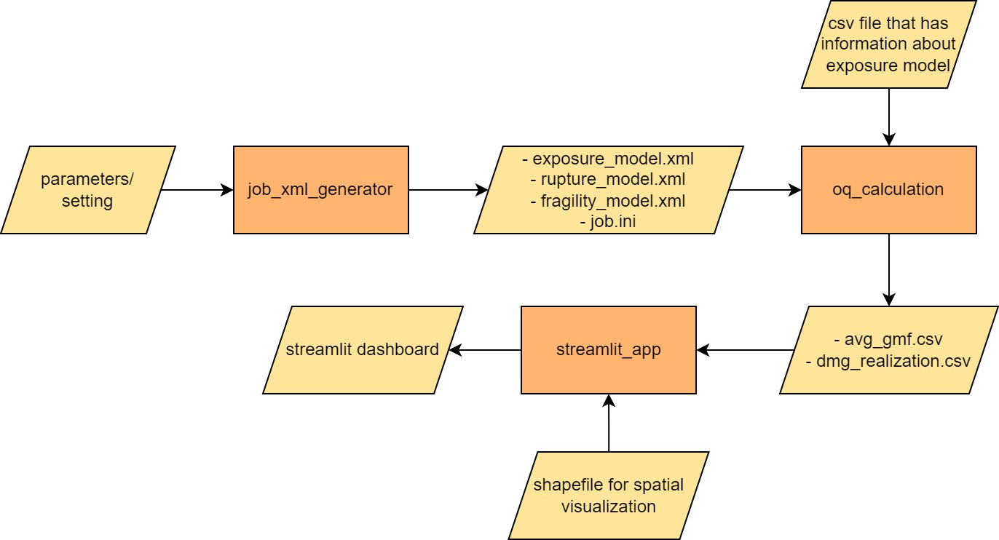
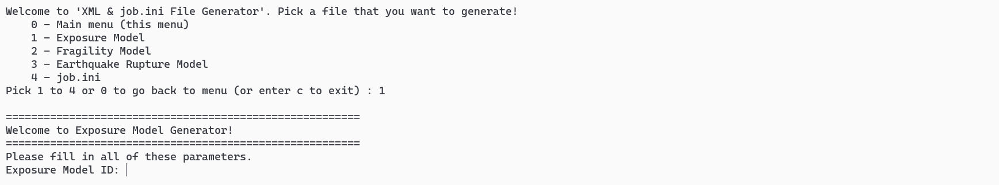
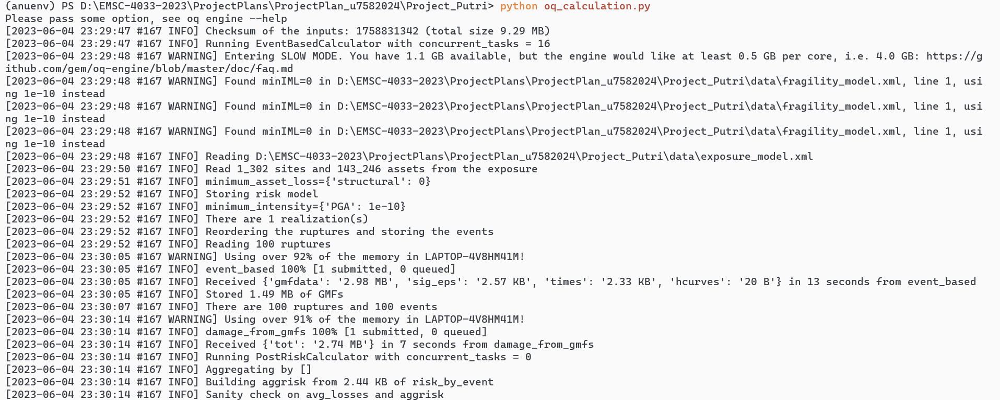
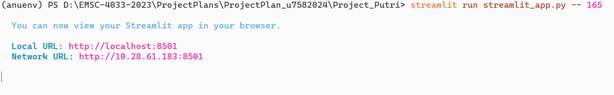

# **Dashboard for Seismic Risk Index Map Based on Building Vulnerability**

This project aims to create an interactive static dashboard that shows seismic risk index map based on the building vulnerability. This dashboard includes the seismic hazard map, fragility curve, and damage distribution map. Target user for this dashboard would be students or researchers.

---

## **Table of Contents**
- [Introduction](#introduction)
- [Program-Structure](#program-structure)
- [Program-Flow](#program-flow)
- [Instalation](#instalation)
- [Usage](#usage)
    - [job_xml_generator.py](#run-job_xml_generatorpy)
    - [oq_calculation.py](#run-oq_calculationpy)
    - [streamlit_app.py](#run-streamlit_apppy)
- [Samples-and-Demo](#samples-and-demo)
- [Limitation](#limitation)

---

## **Introduction**

The purpose of this project is to simplify the process of generating a seismic risk index map by creating programs that can perform the necessary calculations and visualizations. In order to achieve this main goal, the project can be broken down into the following smaller goals:
  - Create a function to create `xml` and `configuration` files as the input files for risk calculation using `openquake` library
  - Calculate seismic risk based on building vulnerability using `scenario damage assessment` mode from `openquake` library
  - Create a visual representation of the ground shaking intensity in different areas (PGA) of the Perth, Western Australia.
  - Create damage distribution map to identify and spatially represent areas that are particularly vulnerable to seismic hazards
  - Build a static dashboard that contains a report on seismic risk index map of Perth Area for each suburb. The dashboard will have several features that will help user to interact with the dashboard, including:
    1. `Zoom` : Users will be able to zoom in and out of the map to get a more detailed or broader view of the seismic risk index data
    2. `Pan` :  Users will be able to move the map view to different areas of the Perth Area to explore the seismic risk index data for different suburbs.
    3. `Filter` : Users will be able to apply filters to the seismic risk index data, such as by risk level or location, to focus on the areas of interest to them.
    4. `Download` : Users will be able to download the seismic risk index data for their selected suburbs in a variety of formats, such as CSV for further analysis or sharing.

---

## **Program Structure**

This project comprises three programs designed to facilitate seismic risk analysis and visualization.  

1. **`job_xml_generator.py`**

    `job_xml_generator.py` is a program designed to generate NRML data model (XML-based data) and configuration file that serve as input for `oq_calculation.py`. It accepts user input to enable customization during the file generation process, so that users can provide specific parameters, settings, or configuration details. There are four file that could be created, including `exposure_model.xml`, `fragility_model.xml`, `rupture_model.xml`, and `job.ini`.  
---
2. **`oq_calculation.py`**  

    `oq_calculation.py` is a program aimed to performs OpenQuake calculations required for ground motion modeling and probability of damage distribution. It uses input files generated from `job_xml_generator.py` and a `csv` file that has information about exposure model defined in `exposure_model.xml`.  
---
3. **`streamlit_app.py`**  

    `streamlit_app.py` is a program that offer a streamlined dashboard experience on Streamlit, allowing users to explore and interact with the outputs generated by `oq_calculation.py` alongside predefined `shapefile` (\*.shp) data.  

Together, these programs provide a solution for seismic risk assessment and visualization that simplifies the process of analyzing and visualizing potential earthquake impacts.

---

## **Program Flow**
The flow of the programs can be seen in `Figure 1`.
&nbsp;

*Figure 1. Flow of the programs in this project*

---

## **Instalation**

All of the dependencies needed for these programs is provided in [requirements.txt](./requirements.txt). To install it, open the terminal or command prompt and navigate to your working directory. Once inside the directrory, execute the following command:
 ```bash
pip install -r requirements.txt
```
This command will automatically install all the dependencies listed in the [requirements.txt](./requirements.txt), ensuring that the system has all the necessary packages and libraries to run the code smoothly.
    
> **WARNING**
> - streamlit version required in this program only works for `Python` version >= 3.7 and !=3.9.7  
> - If you already have some of libraries/modules defined in [requirements.txt](./requirements.txt), there may be some dependency conflicts, and you may need to resintall them by executing the following command:
> ``` bash
> pip install --upgrade --force-reinstall -r requirements.txt
> ```
---

## **Usage**
To successfully run these programs, please follow the following instructions:

### **Run `job_xml_generator.py`**
- Prepare all parameters/setting that will be inputted in this program. As a sample, [samples_parameter](samples/samples_parameter.xlsx) is prepared in [samples](./samples/) folder as an example to guide you running this program.
- Create [data](./data/) folder.
- Prepare `csv` file that has information about exposure model that will be defined in `exposure_model.xml`. This file should be stored in [data](./data/) folder. Information about how to create the `csv` file could be accessed in [OpenQuake_docs](https://docs.openquake.org/oq-engine/manual/latest/risk.html). As a sample, a [csv_file](data/new_exposure_model.csv) is also prepared in [samples/data](./samples/data/) folder.
- To run this program execute the following command in your terminal or command prompt:  
```bash
python job_xml_generator.py
```
 - After you execute the program, a user prompt will appear where you can choose which file you want to generate first as shown in `Figure 2`. Once you chose, there will be another prompt that asks you to fill all of the parameters. You can use parameters in [samples_parameter](samples/samples_parameter.xlsx) in [samples](./samples/) folder here.
&nbsp;

*Figure 2. Prompt for user to input all of the parameters or settings*

&nbsp;

- All generated files (`exposure_model.xml`, `fragility_model.xml`, `rupture_model.xml`, and `job.ini`) will be stored in [data](./data/) folder.
- As a sample, [exposure_model.xml](samples/data/exposure_model.xml), [fragility_model.xml](samples/data/fragility_model.xml), [rupture_model.xml](samples/data/rupture_model.xml), and [job.ini](samples/data/job.ini) have been generated and could be found in [samples/data](./samples/data/) folder.
---
### **Run `oq_calculation.py`**
- Input files for this program are generated from `job_xml_generator.py`.
- Make sure that all `xml` files defined in `job.ini` has the same name with `xml` file in the folder.
- Run this program by executing the following command:
``` bash
python oq_calculation.py
```
- If the program runs successfully, you will see some processes in your terminal or command prompt as shown in `Figure 3`.
    
    &nbsp;
    
    *Figure 3. `oq_calculation` program is running successfully*
    
    &nbsp;

- There are 5 outputs generated by this program, including `gmf_data_X.csv`,`avg_gmf_X.csv`,`damages-rlzs-000_X.csv`,`aggrisk-_X.csv`, and `risk_by_event_X.csv`, with `X` is `calculation_id`. For example, if one of your output is `avg_gmf_160csv`, your `calculation_id` is `160`. These files are stored in [output](./output/) folder. 
- As a sample, [gmf_data_95.csv](samples/output/gmf-data_95.csv), [avg_gmf_95.csv](samples/output/avg_gmf_95.csv), [damages-rlzs-000_95.csv](samples/output/avg_damages-rlz-000_95.csv), [aggrisk-_95.csv](samples/output/aggrisk-_95.csv), and [risk_by_event_95.csv](samples/output/risk_by_event_95.csv) have been generated and could be found in [samples/output](./samples/output/) folder. 
---
### **Run `streamlit_app.py`**
- Input files for this program are generated from  `oq_calculation.py` program and predefined `shapefile` data required forspatial visualization. These data could be found in [output](./output/) and [SHP](./SHP/) folder, respectively.
- To run this program, execute the following command:
``` bash
streamlit run streamlit_app.py -- [calculation_id]
```
For example, if the `calculation_id` is 160, execute the following command:
``` bash
streamlit run streamlit_app.py -- 160
```
- As described before, `calculation_id` is id for every output from `oq_calculation.py`
- This command will start the Streamlit server, and you can access the dashboard by opening the provided local URL in your web browser as shown in `Figure 4` and `Figure 5`.

&nbsp;
*Figure 4. Local URL in the web browser to access the dashboard after executing command to start the streamlit server*

&nbsp;
*Figure 5. Process of generating the dashboard on the web browser*.

---

## **Samples and Demo**
Samples of the output generated from `job_xml_generator.py` and `oq_calculation.py` could be found in [samples](./samples/) folder. These samples could be used to run streamlit dashboard demo. [SHP](./SHP/) folder that holds all shapefile needed to run the dashboard is already available. To run the demo, execute the following command:

```bash
streamlit run demo_streamlit_app.py
```
This command will start the Streamlit server, and you can access the dashboard by opening the provided local URL in your web browser. 

An example pdf-version of the streamlit dashboard generated from `demo_streamlit_app.py` can be seen in [this pdf file](./streamlit_app.pdf) 

---

## **Limitation**
There are some limitations of these programs,
1. `job_xml_generator.py`
    - `rupture_model_input()` and `create_rupture_model_xml()` functions only work for **Simple Fault Geometry**. It has not facilitated other rupture types like **Arbitrary Fault Rupture**, **Single Planar Rupture OR Multi-Planar Rupture**, and **Complex Fault Rupture**.
    - `job_ini_input()` and `create_job_ini()` functions are designed to create configuration file for **scenario_damage** calculation mode only. It cannot be used for other modes that `OpenQuake Engine` facilitate.
2. `oq_calculation.py`  
    This program also only works for **scenario_damage** calculation mode.
3. `streamlit_app.py`  
    This program loading of substantial data to generate charts, which requires a long time to create the dashboard. Additionally, when users interact with the dashboard and initiate changes, there is a tendency for the program to reload and restart the chart plotting process from the beginning. Consequently, this reloading process can result in extended waiting periods for users.

---